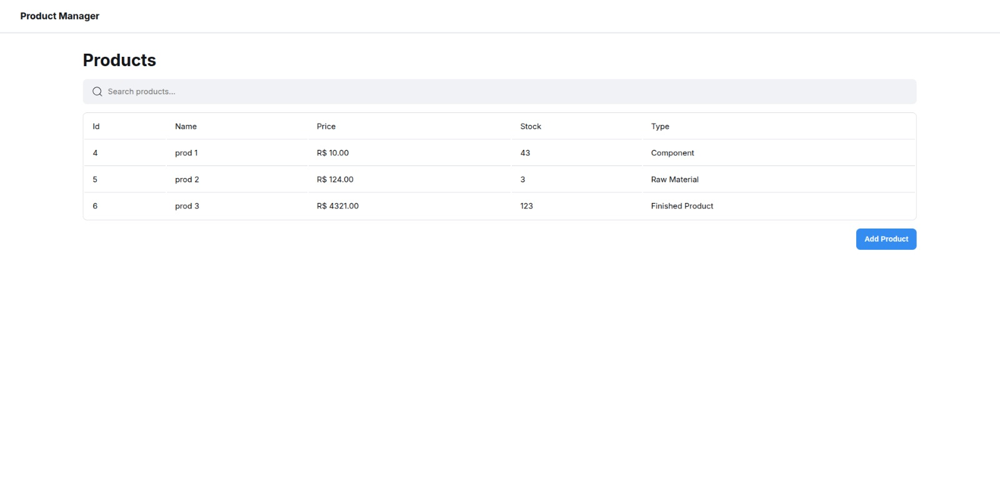
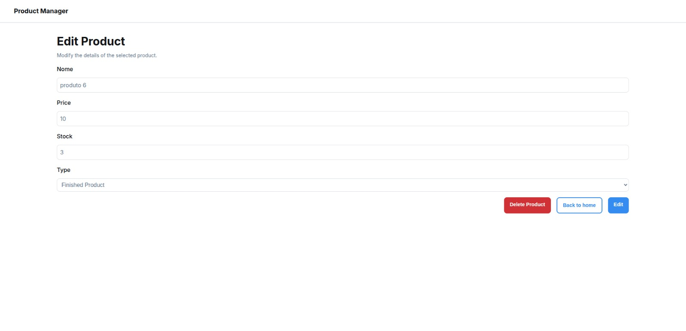
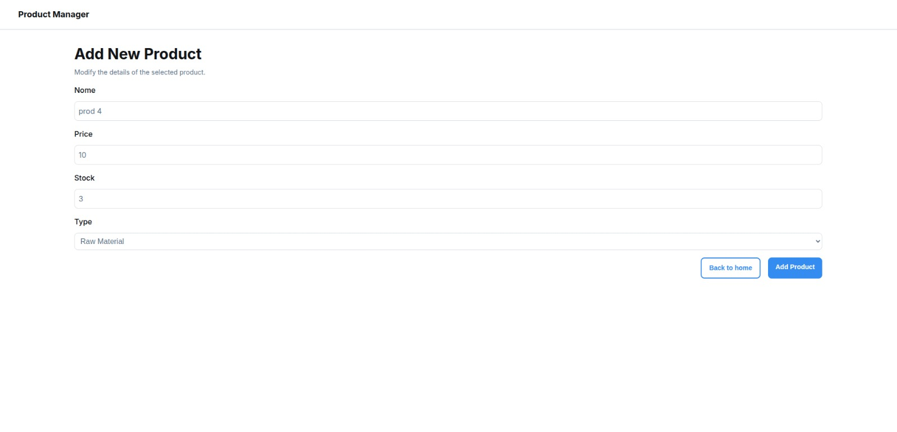
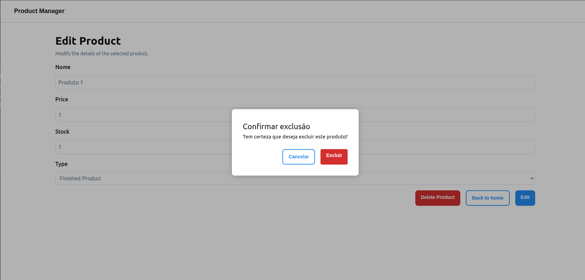

# Solar Market

Sistema completo para gestão de produtos, desenvolvido com Vue 3 no frontend e NestJS no backend, utilizando MySQL como banco de dados. O projeto foi estruturado para rodar facilmente via Docker Compose, facilitando o desenvolvimento e a execução local.

---

## Prints da Aplicação

> 
> 
> 
> 

---

## Instruções de Instalação

### Pré-requisitos

- [Docker](https://www.docker.com/)
- [Docker Compose](https://docs.docker.com/compose/)

### Passos para rodar o projeto

1. **Clone o repositório:**
   ```sh
   git clone https://github.com/V-Matheus/Product-Manager.git
   cd Product-Manager/
   ```

2. **Suba todos os serviços com Docker Compose:**
   ```sh
   docker compose up --build
   ```

3. **Acesse a aplicação:**
   - Frontend: [http://localhost:3000](http://localhost:3000)
   - Backend: [http://localhost:3001](http://localhost:3001)
   - MySQL: `localhost:3306` (usuário/senha definidos no `.env` do backend)

4. **Rodando testes unitários:**
   - Frontend:
     ```sh
     cd frontend
     yarn test:unit
     ```

---

## Tecnologias Escolhidas e Motivos

- **Vue 3 + Vite:**  
  Framework moderno, rápido e com excelente suporte a TypeScript. O Vite proporciona hot reload eficiente e build rápido.

- **NestJS:**  
  Estrutura robusta para backend em Node.js, com arquitetura modular, injeção de dependências e integração fácil com TypeORM/MySQL.

- **MySQL:**  
  Banco relacional amplamente utilizado, fácil de configurar com Docker e compatível com TypeORM.

- **Docker Compose:**  
  Facilita o gerenciamento dos serviços (frontend, backend, banco) e garante ambiente consistente para todos os desenvolvedores.

- **Vitest/Jest:**  
  Ferramentas modernas para testes unitários, rápidas e integradas ao ecossistema Vue/NestJS.

---

## O que faria diferente com mais tempo

- Implementaria testes de integração e e2e completos.
- Criaria testes para a API.
- Construiria e consumiria uma API do tipo GraphQL.
- Refatoraria o frontend para um design responsivo.
- Uso do contextos globais para melhor aproveitamento dos recursos.

---

## O que gostaria de melhorar

- Melhorar a experiência do usuário para múltiplos dados com lazy loading e scroll infinito.
- Otimizar a resposta do backend.
- Documentar melhor a aplicação com Storybook e Swagger.
- Configuraria CI/CD para deploy.

---

## Estrutura de Pastas

```
projects/
├── backend/
│   ├── src/
│   ├── dockerfile
│   └── package.json
├── frontend/
│   ├── src/
│   ├── dockerfile
│   └── package.json
├── docker-compose.yml
├── README.md
├── docs/
│   └── prints
└── .github/
    └── workflows/
        └── CI-CD.yml
```

---
